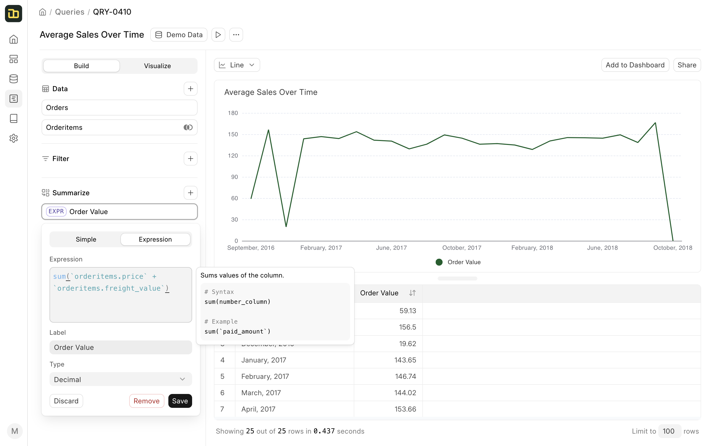

# Expressions

Expressions are used to add complex calculations to your query. You can use expressions to create complex filter conditions and to create calculated columns.

You can use expressions to create calculate new columns from existing columns. For example, you can create a new column that calculates the percentage of revenue generated by each product category.

To create a custom column or filter, switch to the **Expressions** tab in the Columns/Filter section.

::: tip Expression Help
You can start typing a method or function name to see a list of available options. You can also use the autocomplete feature to see an example of how to use the method or function.

Alternatively, you can click on the **Help** icon to see a list of available methods and functions.
:::

## Aggregations

While creating a custom column, you can use aggregations to summarize the column values. Following are the available aggregations:

- **sum** - Sums up the values of a metric.
- **avg** - Calculates the average of the values of a metric.
- **min** - Finds the minimum value of a metric.
- **max** - Finds the maximum value of a metric.
- **count** - Counts the number of rows in a column.
- **count_if** - Counts the number of rows in a column that meets a condition.
- **sum_if** - Sums up the values of a metric that meet a condition.
- **distinct** - Returns the distinct values of a column.

## Operators

You can use operators to perform calculations on the values of your columns. Following are the available operators:

- **+** - Adds two numbers.
- **-** - Subtracts two numbers.
- **\*** - Multiplies two numbers.
- **/** - Divides two numbers.
- **=** - Checks if two values are equal.
- **!=** - Checks if two values are not equal.
- **>** - Checks if the first value is greater than the second value.
- **>=** - Checks if the first value is greater than or equal to the second value.
- **<** - Checks if the first value is less than the second value.
- **<=** - Checks if the first value is less than or equal to the second value.
- **&&** - Checks if both conditions are true.
- **||** - Checks if either condition is true.

## Functions

You can use functions to transform, generate and manipulate data. Following are the available functions:

- **abs**: Returns the absolute value of a number.
- **floor**: Rounds a number down to the nearest integer.
- **ceil**: Rounds a number up to the nearest integer.
- **round**: Rounds a number to the nearest integer.
- **now**: Returns the current date and time.
- **today**: Returns the current date.
- **timespan**: Returns two dates based on interval and unit.
- **case**: Returns a value based on conditions.
- **in**: Checks if a value is in a list.
- **not_in**: Checks if a value is not in a list.
- **is_set**: Checks if a column is set.
- **is_not_set**: Checks if a column is not set.
- **between**: Checks if a value is between two values.
- **if_null**: Returns a value if a column is null.
- **coalesce**: Returns the first non-null value.
- **contains**: Checks if the column value contains a substring.
- **not_contains**: Checks if the column value does not contain a substring.
- **ends_with**: Checks if the column value ends with a substring.
- **starts_with**: Checks if the column value starts with a substring.
- **replace**: Replaces a substring with another substring.
- **lower**: Converts a string to lowercase.
- **upper**: Converts a string to uppercase. 
- **concat**: Concatenates two strings.
